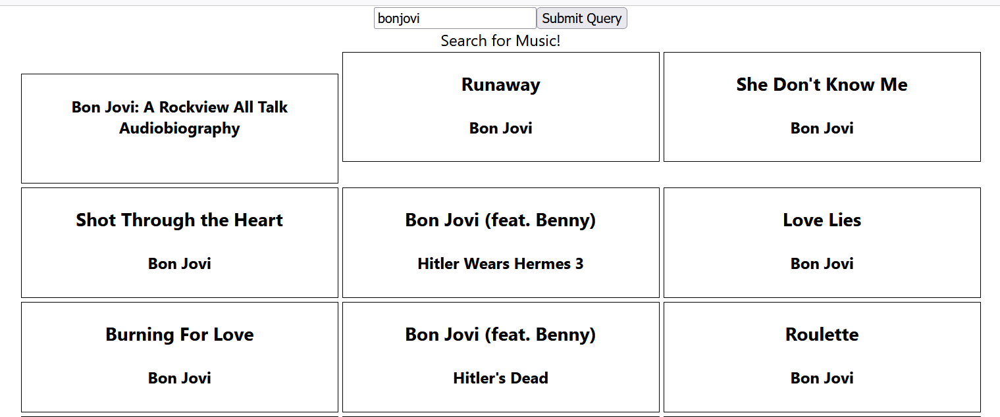

README MUSIC SEARCH
What is the Music Search Bar?
This allows the user to enter their favorite artist or music title using a search bar in a WEB browser. 

SUMMARY
This employs the following components:
1. .tsx- this is type of file that utilizes codes using REACT and JSX components.
2. .ts- this is a Typescript and is superset of JavaScript
3. Include an image of the Search Bar Page
4. HTML (HyperText Markup Language) - Typescript with .js extension compiled in JS
5. Styling in .css
6. JSON - Files that contains data
7. Changes in the code is stored in GitHub repository

CONCLUSION
This is a great page that utilizes all these components and user friendly. 

